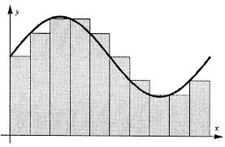

# Strategy Pattern and Parabolic Movement

## Objective
1. Develop a further understanding of the strategy pattern.
2. Implement parabolic/projectile motion for the drone.

## Background

The Strategy Pattern is part of the Gang of Four's Behavioral Patterns. The strategy pattern defines a family of algorithms, encapsulates each one, and makes them interchangeable. Strategy lets the algorithm vary independently from clients that use it. 

 

A great example of the strategy pattern is a standard calculator. In this analogy the concrete classes would consist of addition, subtraction, multiplication, and division. The strategy would be an interface named operation. In this context, you could have a vector of numbers called operands and a vector of operator class pointers to calculate the inputted algorithm. 

## Different Drone Movement Strategies

The scope of iteration two deals with two movement strategies: beeline, patrol. These algorithms are separate but do however take in similar parameters: a source position, speed, and framerate. At first glance, the intuitive approach may be to create a third strategy called Parabola. However, due to the similarity between beeline and parabola, inheritance could be used on beeline. Parabola is-a beeline. The name beeline may not be the most optimal in this case but both strategies are a interpolation between two points.

The goal of the parabola is to create a path consisting of three dimensional points for the drone to follow.  If done correctly, our context class (Drone) need only keep track of a Strategy* member attribute that it may call CalculatePosition() on. CalculatePosition() is the <i>AlgorithmInterface()</i> function.

## Theory

If we only have two points in three dimensional space, all with varying dimensions, how do we calculate a parametric equation from these point? 

Recall from the fundamentals of calculus we can use the Riemann sum, which uses a domain of discrete points, to estimate a continuous function. A parabola, as it is usually described, is a continuous function. Therefore, the Riemann sum can be used in our simulation to create the set of points needed for the drone to follow a parabolic route.

From limit theory it has been shown that with an infinite amount of test points the Riemann sum becomes the function being estimated. So, in order to calculate the Riemann sum we need a set of sample points.

Applying this to iteration two, this would consist of equidistant points dividing the interval between source and destination. I.e. Drone to Robot position or charging station.

Associated with any parabola is a vertex that represents either the maximum or minimum value. The height (maximum value) we will need is a specified y offset from the horizontal axis. This value is a tuning parameter and can be altered to achieve the desirable result.

 

In order to identify the domain for our parabola, it may be helpful to think about our source and destination point. The route(parabola) the drone will follow is dependent on the sampling increments used in the simulation. A greater number of sampling points, the smoother the route, but too many sampling points may lead to slower execution of the simulation.

As an example, one step will likely make our drone fly in a triangular pattern, whereas one hundred increments will make our drone follow a very smooth parabolic path.

Calculations for the parabola may be represented as such:

</pre><code style="width:100%;color:#006666;">Y = -a(x - i)2 + j (1)</code></pre>

Considering that we are actually trying to represent a 2d parabola in 3d space, some projection algebra will be needed leaving us with the equation:

</pre><code style="width:100%;color:#006666;">y = (1 - distance(V, Vm)2 / distance(Vo, Vm)2) * j (2)</code></pre>

Let's take a moment to define our notation. 
<ul>
    <li>Vo is our source point</li>
    <li>V is the point we are moving to</li>
    <li>Vm is our midpoint equal to distance(source, destination) / 2</li>
    <li>T is the number of steps we are estimating</li>
    <li>Vt is our step interval equal to distance(source, destination) / T</li>
</ul>

The vertex in this context is the point at which the sign of the parabola's slope flips.
In our case, the vertex (Vm.x, Vm.y + j, Vm.z) is represented by the midpoint between source and destination (Vm) and the desired maximum height of the parabola (j). (j) is a tuning parameter that we can use to avoid building collision and scale the parabola's slope.

The y value is our dependent variable that is determined by our unknown independent variable v. Circling back to before, this value v is related to our sample points or domain. If we want a parabolic path that samples 5 points (T), we need to take the distance between source and destination and divide it by 5. 

To find the correct v vector, we need to take the source, add the step interval vector and multiply it by the number of steps desired (t). We do not want this to be greater than our total number of steps (T). 0 steps would leave us at the source point whereas 5 steps will leave us at the destination. The following equation represents our V from before (2) and is an adaptation to the formula for a ray:

</pre><code style="width:100%;color:#006666;">V = Vo + Vt*t (3)</code></pre>

Something to consider in our implementation is the case where we have an even versus odd number of steps where the max height in 5 steps could be reached at 2.5 steps. To address this condition we can always ensure that T is even and if it is not add 1 which is ideal since the case where we have one step will never be desired for estimating a parabola.

Lastly, our resulting path will be a vector of vectors with size T and format:

</pre><code style="width:100%;color:#006666;"><V.x, V.y + Y, V.z> (4)</code></pre>

### For the adventurous

Many of the ideas mentioned above can be expanded upon. A compound pattern could be implemented so that a fourth strategy is added called the composite strategy. This composite strategy would be just like the others with the only difference being that it possess some statefulness (a vector of strategies). It would possess a method called addStrategy and its AlgorithmInterface would call the other strategies in the vector, merge/compute them, and then return the final result. This is similar to how the composite factory is implemented.

Lastly, midpoint and rk4 methods could be used to better estimate the parabola. This would be done by using recursion to calculate a step in the future and using that future result to calculate the present result. However due to the parabola being bounded this level of complexity is not entirely necessary.
